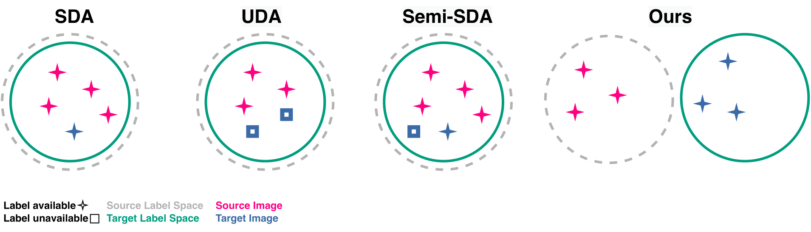
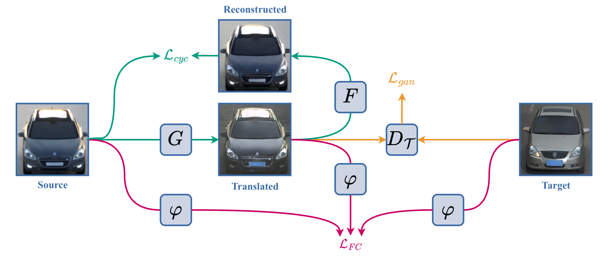
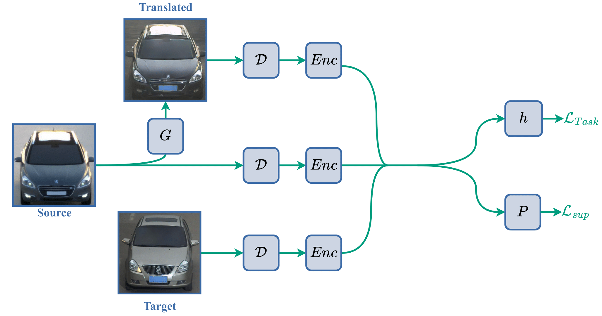

### Supervised Domain Adaptation with Disjoint Label Spaces for Fine-Grained Classification



#### About
---
Official code-base for our paper that was used to generate all results. Code includes our training framework for supervised domain adaptation with disjoint label spaces, including our novel FCCGAN. Additionally, we provide re-implementations of [DANN](https://www.jmlr.org/papers/volume17/15-239/15-239.pdf), [DAN](http://proceedings.mlr.press/v37/long15.pdf) as well as [CyCADA](http://proceedings.mlr.press/v80/hoffman18a/hoffman18a.pdf). 

This repository directly uses this [lightning-hydra-template](https://github.com/ashleve/lightning-hydra-template) and is heavily based on the official [Cyclegan](https://github.com/junyanz/pytorch-CycleGAN-and-pix2pix) repository. Please refer to the LICENSE section for proper copyright attributions.

A link to our paper can be found [here](https://openaccess.thecvf.com/content/ACCV2024W/AWSS/papers/Krohmer_Supervised_Domain_Adaptation_with_Disjoint_Label_Spaces_for_Fine-Grained_Classification_ACCVW_2024_paper.pdf).

#### Installation
---
```bash
pip install -r requirements.txt
pip install .
```

#### Reproduce Results
---
To reproduce our results first download the [Synset Boulevard](https://synset.de/datasets/synset-blvd/) and [CompCars Surveillance]() datasets. And execute

```bash
python sda_dls/scripts/make_dataset.py
```

Pre-Train a feature extractor as well as the base-model for two-step training

```python
python sda_dls/train.py -cn extractor
python sda_dls/train.py -cn two_step
```

And then train the FCCGAN:

```bash
python sda_dls/train.py -cn supcon \
model.task_strategy.pretrained_path='path/to/two_step/checkpoint','net_C' \
model.cgan_strategy.criterion_fc.pretrained_path='path/to/extractor/checkpoint','net_C'

```


#### Citation
---
If you use this codebase, or otherwise find our work valuable, please cite SDA-DLS:

```bibtex
@inproceedings{krohmer2024supervised,
  title={Supervised Domain Adaptation with Disjoint Label Spaces for Fine-Grained Classification},
  author={Krohmer, Enrico and Wolf, Stefan and Beyerer, J{\"u}rgen},
  booktitle={Proceedings of the Asian Conference on Computer Vision},
  pages={50--66},
  year={2024}
}
```

#### License
---
MIT

